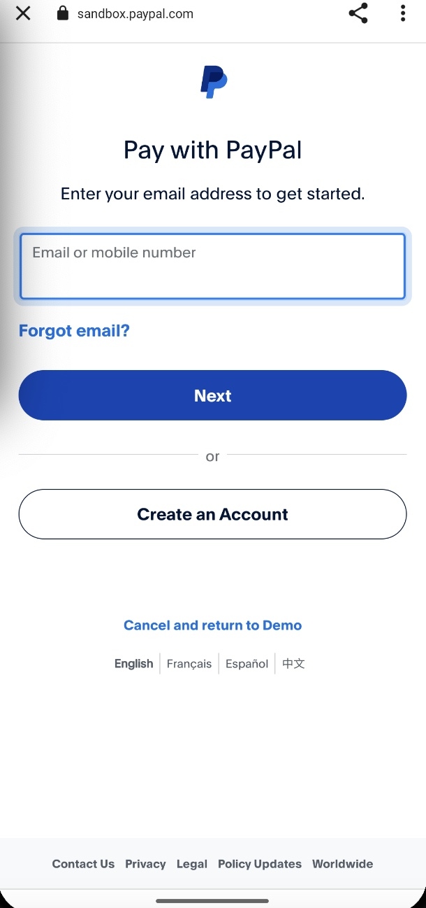
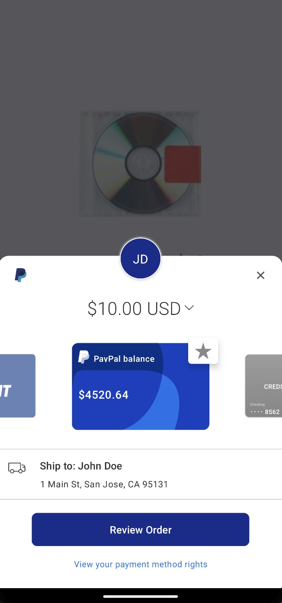

# PayPal Demo Instructions
***

Initial Setup
***

Configure Gradle
* Add necessary dependencies for OkHttp, Coroutines, PayPal SDK and PayPal button

PayPal SDK
***

Follow PayPal documentation to set up payment integrations with [Native Payments](https://developer.paypal.com/docs/checkout/advanced/android/).

Set the scheme in the intent filter to match the PayPal callback URL

User Interface
***

Create simple UI
* Use XML to make a simple screen with PayPal button
* Implement onClick logic to initiate PayPal processing

Login into PayPal with Sandbox account to finish the transaction

